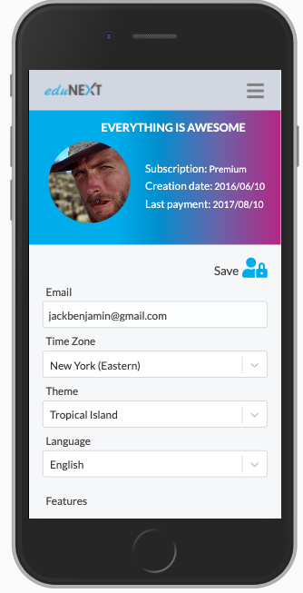
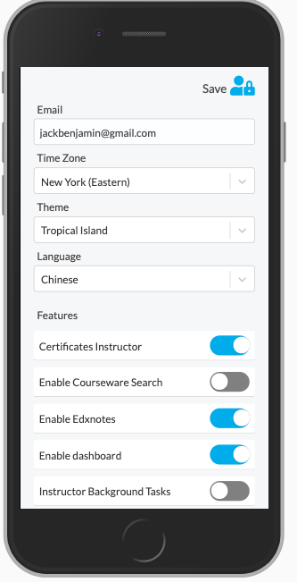
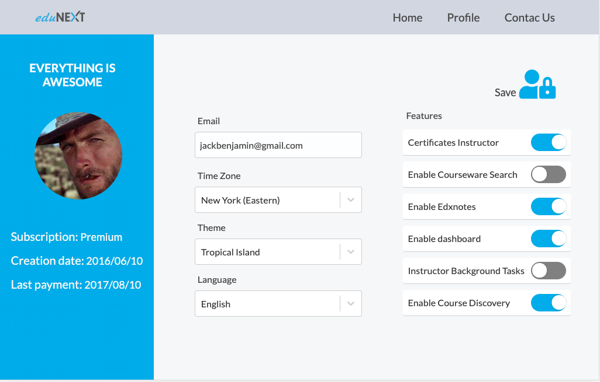

# Settings Page

This project is an application where the user can interact with their own data.

# High prototype

## -Mobile

   

## -Web

 

### The user can view the following data
   
  - Welcome Message
   - Type subscription
   - Creation date 
   -Las payment date
   - Profile Image 
   - Time Zone
   - Email
   - Language
   - Theme name
   - Features list

### The user will be able to edit the fields

   - Email
   - Language
   - Theme name
   - Time Zone
   - Features list

After the user edits the information by pressing the save button, his data will be updated.

# Technologies

-- ReactJs
-- Axios
-- React Router
-- React select
-- React toastify
-- SCSS

# Instructions
   
   1. Clone the repository`
   2. Install packages `npm install`
   3. Run `npm start` Open [http://localhost:3000](http://localhost:3000) to view it in the browser.
   
If you want to try a different user go to the following path src/utils/userId.js, the file contains three id of different users. You can deactivate the current user and activate a new one

